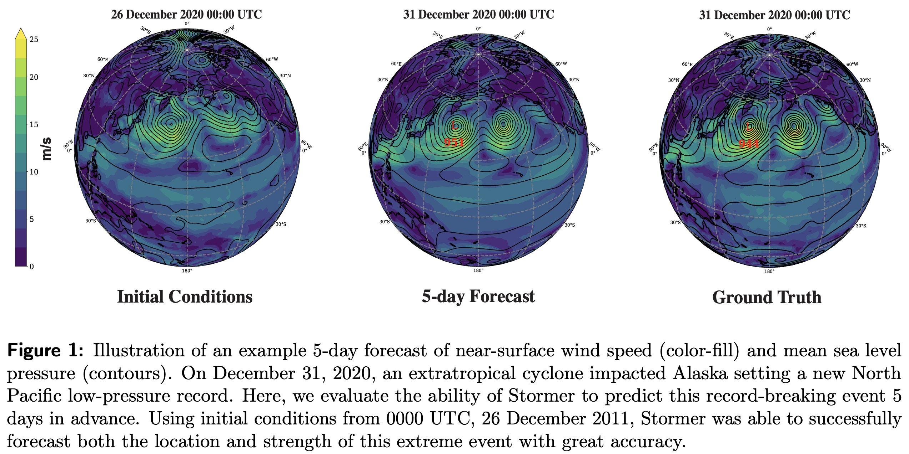

# Scaling transformer neural networks for skillful and reliable medium-range weather forecasting

This is the official implementation of [Stormer](https://arxiv.org/abs/2312.03876) in Pytorch. Stormer is a simple transformer model that achieves state-of-the-art performance on weather forecasting with minimal changes to the standard transformer backbone.



## Install

First, clone the repository:

```bash
git clone https://github.com/tung-nd/stormer.git
```

Then install the dependencies as listed in `env.yml` and activate the environment:

```bash
conda env create -f env.yml
conda activate tnp
```

Finally, install the stormer package

```bash
pip install -e .
```

## Usage

### Download and process data

We trained Stormer on ERA5 data from WeatherBench 2. To download WB2 data, run

```bash
python stormer/data_processing/download_wb2.py --file [DATASET_NAME] --save_dir [SAVE_DIR]
```
in which [DATASET_NAME] refers to the specific version of ERA5 that WB2 offers, e.g., `1959-2023_01_10-6h-240x121_equiangular_with_poles_conservative.zarr`. For more detail, see [here](https://weatherbench2.readthedocs.io/en/latest/data-guide.html#era5). Note that this will download all available variables in the dataset. After downloading, the data sructure should look like the following:

```bash
wb2_nc/
├── 2m_temperature/
│   ├── 1959.nc
│   ├── 1960.nc
│   ├── ...
│   └── 2023.nc
├── geopotential/
├── specific_humidity/
├── other variables...
├── sea_surface_temperature.nc
├── sea_ice_cover.nc
├── surface_pressure.nc
├── total_cloud_cover.nc
└── other constants...
```

(Optional) If you want to regrid the data to a different resolution, e.g., 1.40625&deg;, run

```bash
python stormer/data_processing/regrid_wb2.py \
    --root_dir [ROOT_DIR] \
    --save_dir [SAVE_DIR] \
    --ddeg_out 1.40625 \
    --start_year [START_YEAR] \
    --end_year [END_YEAR] \
    --chunk_size [CHUNK_SIZE]
```

We then convert the netCDF file to H5DF format for easier data loading with Pytorch. To do this, run

```bash
python stormer/data_processing/process_one_step_data.py \
    --root_dir [ROOT_DIR] \
    --save_dir [SAVE_DIR] \
    --start_year [START_YEAR] \
    --end_year [END_YEAR] \
    --split [SPLIT] \
    --chunk_size [CHUNK_SIZE]
```

The H5DF data should have the following structure

```bash
wb2_h5df/
├── train/
│   ├── 1979_0000.h5
│   ├── 1979_0001.h5
│   ├── ...
│   ├── 2018_1457.h5
│   └── 2018_1458.h5
├── val/
│   └── validation files...
├── test/
│   └── test files...
├── lat.npy
└── lon.npy
```

in which each h5 file of name `{year}_{idx}.h5` contains the data for all variables of a specific time of the year. The time interval between two consecutive indices depends on the data frequence, which is 6 hours by default in WB2.

Finally, we pre-compute the normalization constants for training Stormer. To do this, run

```bash
python stormer/data_processing/compute_normalization.py \
    --root_dir [ROOT_DIR] \
    --save_dir [SAVE_DIR] \
    --start_year [START_YEAR] \
    --end_year [END_YEAR] \
    --chunk_size [CHUNK_SIZE] \
    --lead_time [LEAD_TIME] \
    --data_frequency [FREQUENCY]
```

NOTE: start and end year must correspond to training data. Root dir should point to wb2_nc directory, and save_dir is your H5DF data directory. To compute normalization constants for the input, set LEAD_TIME to None, otherwise set it to the interval value you want to compute normalization constants for, e.g., 6.

## Training

To pretrain Stormer on one-step forecasting loss, run

```bash
python train.py \
    --config configs/pretrain_one_step.yaml \
    --trainer.default_root_dir [EXP_ROOT_DIR] \
    --model.net.patch_size 4 \
    --data.root_dir [H5DF_DIR] \
    --data.steps 1 \
    --data.batch_size 4
```

To finetune Stormer on multi-step forecasting loss, run

```bash
python train.py \
    --config configs/finetune_multi_step.yaml \
    --trainer.default_root_dir [EXP_ROOT_DIR] \
    --model.net.patch_size 4 \
    --model.pretrained_path [PATH_TO_CKPT] \
    --data.root_dir [H5DF_DIR] \
    --data.steps [STEPS] \
    --data.batch_size 4
```

## Inference
`inference.py` shows an example of loading a pretrained model and running inference on a sample data point.

## Citation

If you find this repo useful in your research, please consider citing our paper:
```
@article{nguyen2023scaling,
  title={Scaling transformer neural networks for skillful and reliable medium-range weather forecasting},
  author={Nguyen, Tung and Shah, Rohan and Bansal, Hritik and Arcomano, Troy and Madireddy, Sandeep and Maulik, Romit and Kotamarthi, Veerabhadra and Foster, Ian and Grover, Aditya},
  journal={arXiv preprint arXiv:2312.03876},
  year={2023}
}
```
